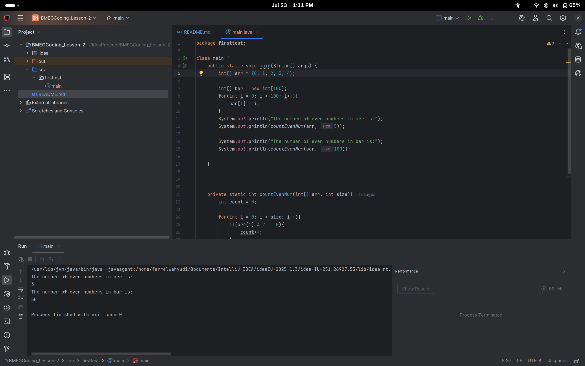
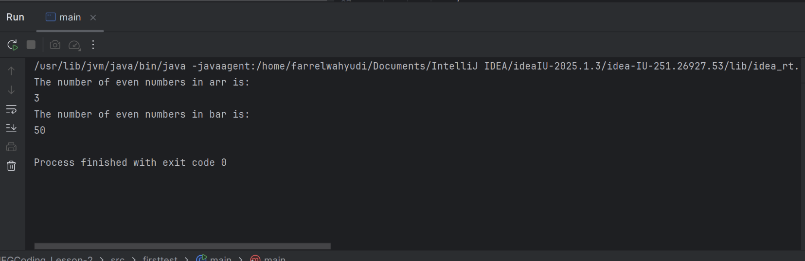

# BMEG Coding Lesson 2

## Overview 
This project is an implementation of what I have learned in the BMEG Coding Intensive course by UBC SBME. In this section, we are learning the 3 big tools of IntelliJ IDEA which are:
1. Version Control
2. Refactoring
3. Debugging

## Assignment
### Instruction
> To ensure that you got the take aways of lesson 2, get your code running in InteliJ, try to refactor 1 variable name, provide a screen shot of the output of the code from the IntelliJ console, and provide a link to your public github repository that has the code. The video in section 2 will be very useful!
### Delivarables
> Screenshot of console output
> 1. Either upload or include in GitHub repository README.md
> 2. Link to public github repository of code

## Submission
For this submission, we are required to upload a screenshot of our console output and refactor 1 variable. I decide to change the variable name of foo to arr to make it easier to identify for me that the variable is an array instead of an unknown variable name such as foo.
### Screen Capture

### Console Output Capture
